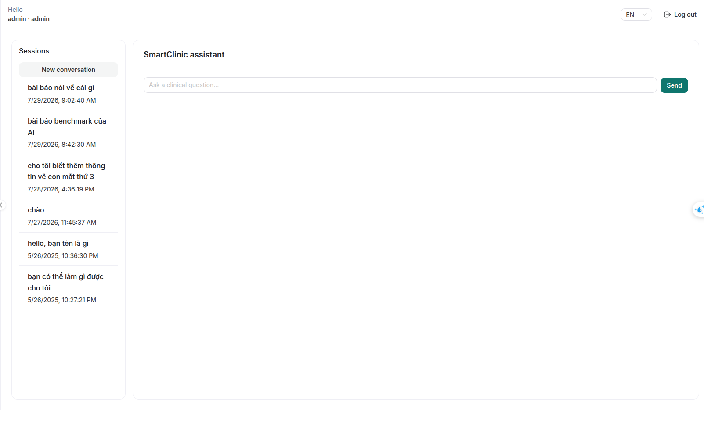
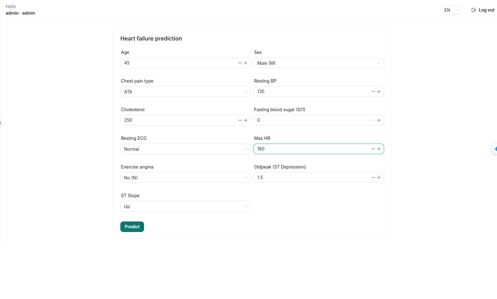
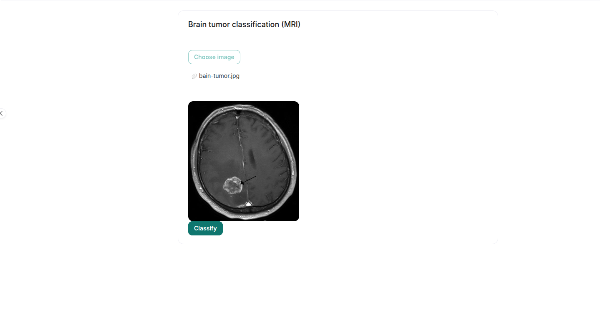
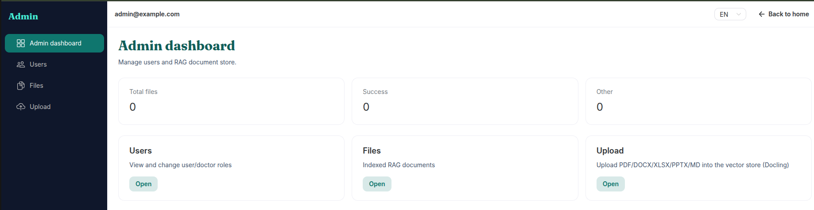

# SmartClinic

**AI-assisted clinical decision support** for care teams — faster risk screening and instant answers from your clinic’s own documents.

> Outputs are **assistive only**. Final clinical decisions remain with licensed professionals.

---

## Overview

  
   
  <em>Home — an overview of SmartClinic's features.</em>

### 🤖 AI chat grounded in your clinic's documents

  
   
  <em>Ask questions answered from your clinic's own documents.</em>

### 🫀 Risk screening (heart, lung, breast cancer)

  
   
  <em>Screen for heart failure / lung cancer / breast cancer risk.</em>

### 🧠 Brain tumor classification from MRI images

  
   
  <em>Upload an MRI image to classify brain tumors.</em>

### 🛠️ Administration

  
   
  <em>Admin dashboard: users, documents, and records.</em>

---

## What SmartClinic offers

| Capability | Who it’s for |
| --- | --- |
| AI chat grounded in **internal clinic documents** | Signed-in staff |
| Risk screening: heart failure, lung cancer, breast cancer | User · Doctor · Admin |
| Brain tumor classification from MRI images | Doctor · Admin |
| User management and document ingestion for the knowledge base | Admin |

---

## Guides

| Need | Open |
| --- | --- |
| Prepare environment & run the API | **[doc/setup.md](doc/setup.md)** |
| Run the web app | **[frontend/doc/setup.md](frontend/doc/setup.md)** |
| How to use each feature (with screenshot placeholders) | **[doc/](doc/README.md)** · **[frontend/doc/](frontend/doc/README.md)** |

---

## Quick start

1. Install [uv](https://github.com/astral-sh/uv), Python ≥ 3.11, and Node.js ≥ 20
2. Follow **[Backend setup](doc/setup.md)** (`.env` + start the API)
3. Follow **[Frontend setup](frontend/doc/setup.md)**
4. Open http://localhost:5173 and sign in

**Demo accounts** (created only when the database is empty):

| Role | Email | Password |
| --- | --- | --- |
| Admin | `admin@example.com` | `admin` |
| Doctor | `doctor@gmail.com` | `doctor` |

Change these passwords before any shared or production use.

---

## Roles at a glance

| Role | Can do |
| --- | --- |
| **User** | Chat AI; heart / lung / breast screening |
| **Doctor** | Everything a User can do, plus brain MRI classification |
| **Admin** | Everything above, plus users, document upload, and file management |

---

## License

[Apache 2.0 License](LICENSE) — © 2025 phamkhai108

*SmartClinic supports diagnosis — it does not replace a physician.*
