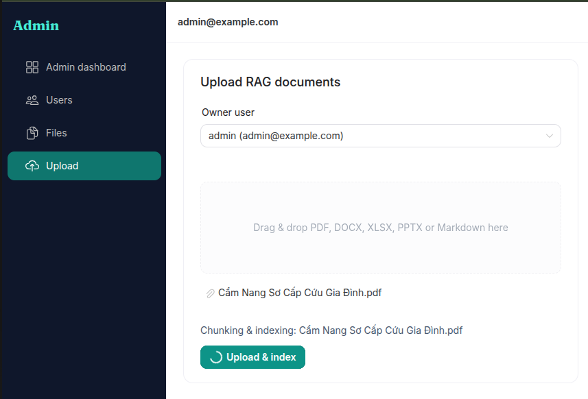
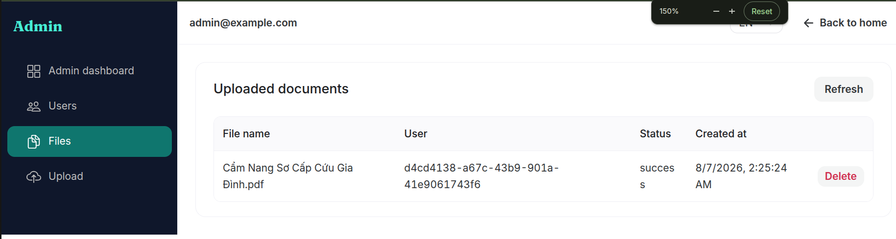
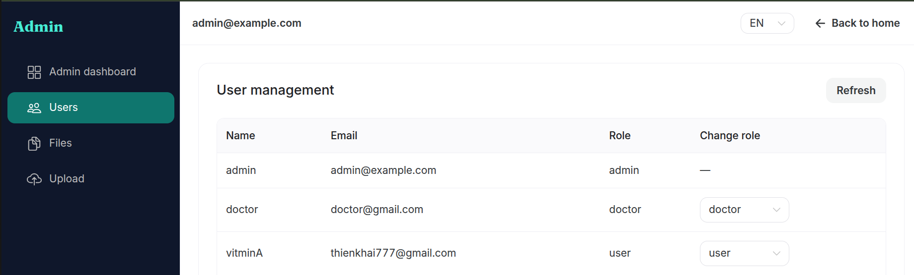

# UI: Admin area

[← UI guides](README.md)

**Admin** only (`/admin/...`). User and Doctor accounts are redirected home if they open these routes.

---

## Dashboard

1. Open **Admin**.
2. Review summaries and shortcuts to Users / Files / Upload.

### Screenshot — Dashboard

> `frontend/doc/images/07-admin-dashboard.png`

---

## Upload documents

1. Open **Upload**.
2. Select the owner user.
3. Choose a supported file (PDF, DOCX, XLSX, PPTX, Markdown).
4. Submit and wait — indexing runs in the background; status becomes `success` or `failed`.

### Screenshot — Upload form

> `frontend/doc/images/08-admin-upload.png`

### Screenshot — After accept / success

> `frontend/doc/images/08b-admin-upload-ok.png`

---

## Files

1. Open **Files**.
2. Check status (`pending` / `success` / `failed`).
3. Delete when a document is no longer needed.

### Screenshot — File table

> `frontend/doc/images/09-admin-files.png`

---

## Users

1. Open **Users**.
2. Switch **User ↔ Doctor** when MRI access should be granted or revoked.

### Screenshot — Users

> `frontend/doc/images/10-admin-users.png`

---

## Suggested UI workflow

1. Upload the standard document pack  
2. Open Chat as a normal user → ask something covered by those docs  
3. Grant Doctor to clinicians who need brain MRI  
4. Sign out on shared machines  

Business guide: [doc/admin-guide.md](../../doc/admin-guide.md)
