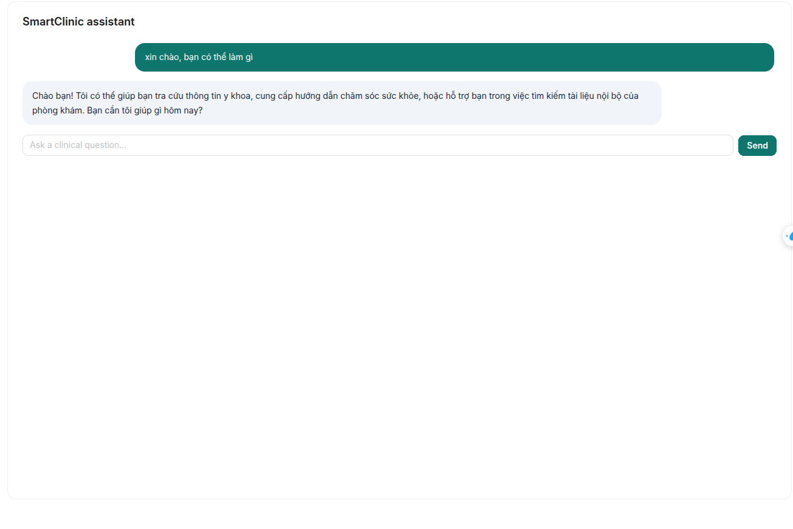
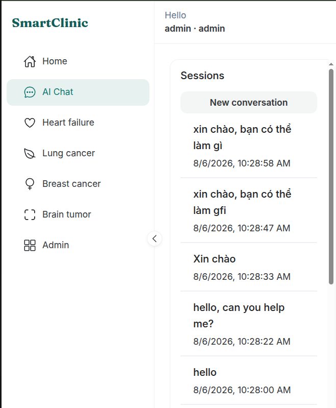
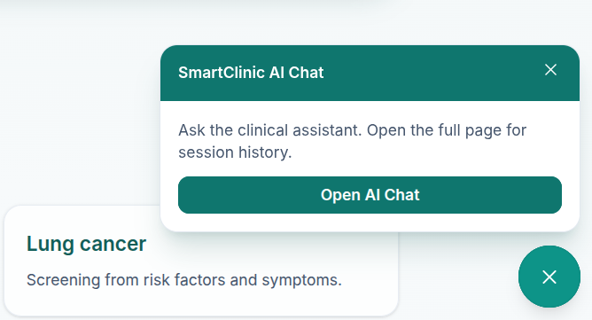

# UI: AI Chat

[← UI guides](README.md)

---

## Open Chat

1. Sign in.
2. Open **AI Chat** (or `/app/chat`).
3. Optionally start a **new conversation**.

---

## Ask a question

1. Type in the input at the bottom of the pane.
2. Send.
3. Read the reply as it streams in.
4. If shown, review **Sources** tags under the answer.

### Screenshot — Full chat view

> `frontend/doc/images/03-chat.png`

### Screenshot — Conversation sample

> `frontend/doc/images/03b-chat-conversation.png`

### Screenshot — Sessions sidebar

> `frontend/doc/images/03d-chat-sessions.png`

---

## Floating widget (public pages)

On the landing page, a floating chat control may prompt sign-in or open the full Chat page.

### Screenshot — Widget (optional)

> `frontend/doc/images/03e-chat-widget.png`

Next: [Clinical screening](prediction.md) · Business guide: [doc/chat-ai.md](../../doc/chat-ai.md)
