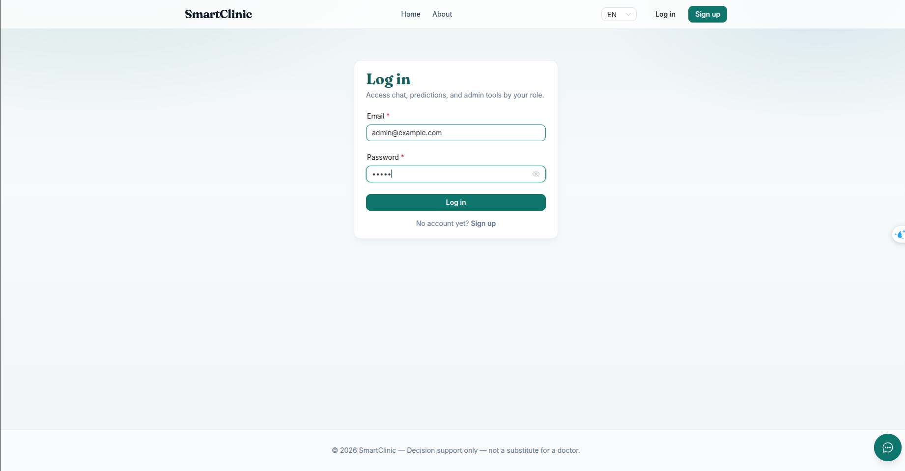
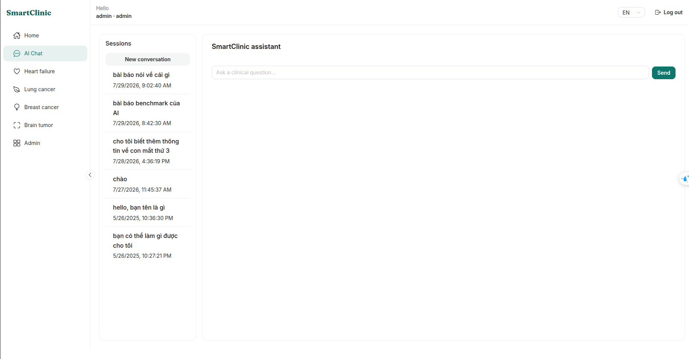
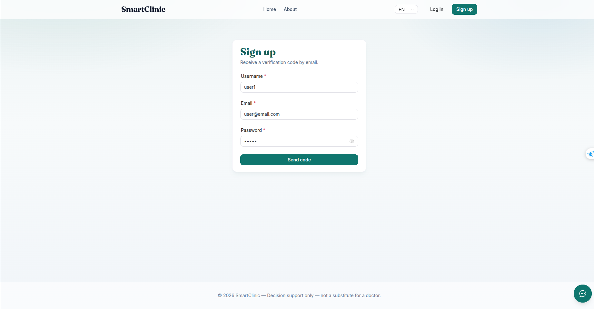

# UI: Sign in & registration

[← UI guides](README.md)

---

## Sign in

1. Choose **Sign in** (or open `/login`).
2. Enter email and password.
3. Submit.
4. You land in the workspace (usually Chat).

If you hit a protected link first, you return there after signing in.

### Screenshot — Sign-in page

<!-- Capture the full sign-in form -->

> `frontend/doc/images/01-login.png`

### Screenshot — Menu after sign-in

<!-- Capture header/sidebar with an active session -->

> `frontend/doc/images/01b-signed-in-menu.png`

---

## Registration

1. Open **Register**.
2. Fill details → **Send verification code** (API must have email configured).
3. Enter the 6-digit code → complete registration.
4. Sign in with the new account.

### Screenshot — Register step 1

> `frontend/doc/images/02-register.png`

### Screenshot — OTP step

> `frontend/doc/images/02b-register-otp.png`

---

## Sign out

Use **Sign out** in the menu to end the browser session.

Next: [AI Chat](chat.md) · Business guide: [doc/login-register.md](../../doc/login-register.md)
