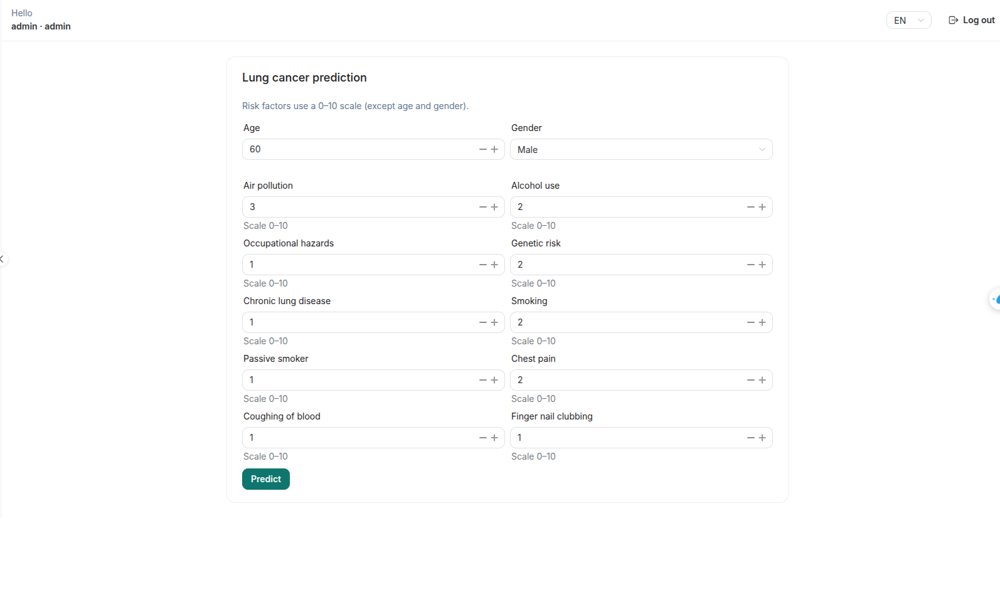
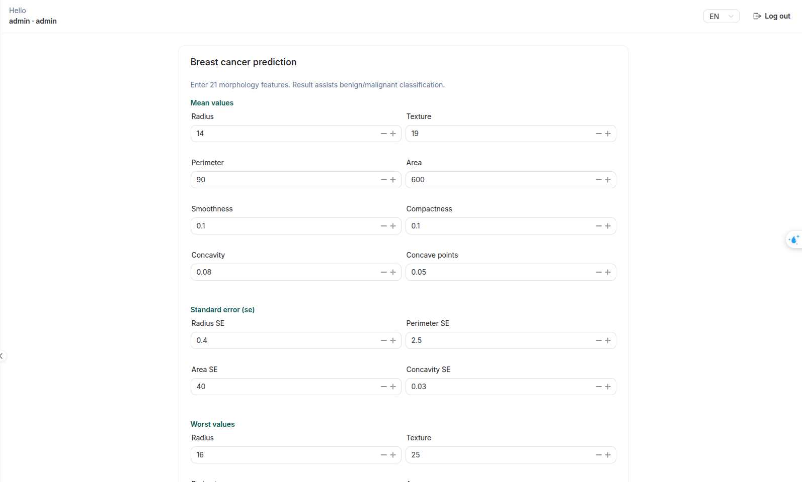
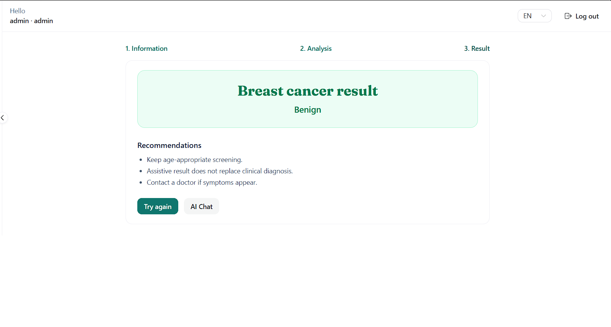
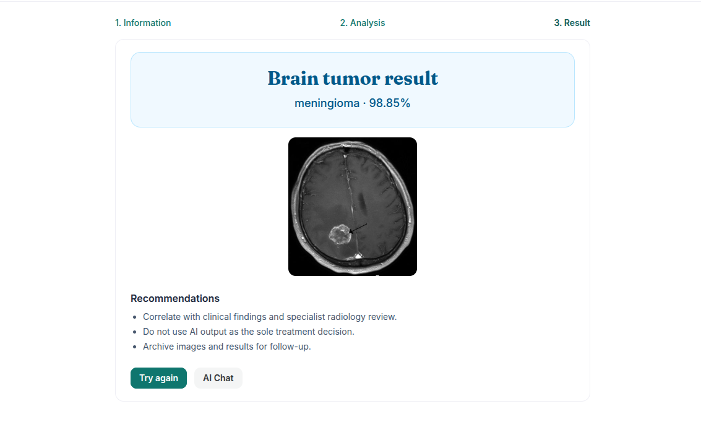

# UI: Clinical screening

[← UI guides](README.md)

---

## Open the right module

From the app menu:

- **Heart failure** → `/app/predict/heart`
- **Lung cancer** → `/app/predict/lung`
- **Breast cancer** → `/app/predict/breast`
- **Brain** → `/app/predict/brain` *(Doctor / Admin only)*

---

## Forms & results (heart / lung / breast)

1. Complete the form using on-screen guidance.
2. Submit.
3. Review the **Results** page (label / risk level and charts when available).
4. Go back to adjust inputs if needed.

### Screenshot — Heart form

> `frontend/doc/images/04-predict-heart.png`

### Screenshot — Lung form

> `frontend/doc/images/04b-predict-lung.png`

### Screenshot — Breast form

> `frontend/doc/images/04c-predict-breast.png`

### Screenshot — Results example

> `frontend/doc/images/05-predict-result.png`

---

## Brain MRI upload

1. Open **Brain** as Doctor or Admin.
2. Choose a JPG/PNG image.
3. Submit and review class + confidence.

### Screenshot — MRI upload

> `frontend/doc/images/06-predict-brain.png`

### Screenshot — Classification result

> `frontend/doc/images/06b-predict-brain-result.png`

---

## UI notes

- Required fields show validation errors before the request is sent.
- “Service unavailable” usually means a missing model or server config — see [backend setup](../../doc/setup.md).

Next: [Admin](admin.md) · Business guide: [doc/clinical-prediction.md](../../doc/clinical-prediction.md)
