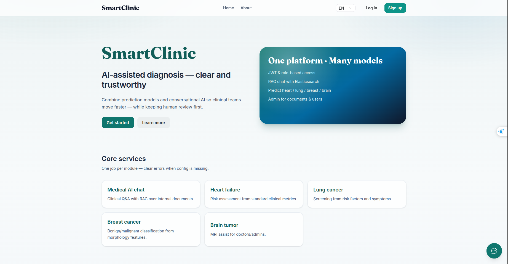

# Setup — Frontend

[← UI guides](README.md)

---

## 1. Prerequisites

| Item | Requirement |
| --- | --- |
| Node.js | ≥ 20 |
| SmartClinic API | Running (default port **8000**) |
| npm | Bundled with Node |

Complete backend setup first: [Backend setup](../../doc/setup.md).

---

## 2. Install & run

```bash
cd frontend
npm install
npm run dev
```

Open **http://localhost:5173**

| Command | When to use |
| --- | --- |
| `npm run dev` | Day-to-day development |
| `npm run build` | Production build |
| `npm run preview` | Preview the production build |

---

## 3. Point to the API

Create or edit `frontend/.env.development`:

```env
VITE_API_BASE_URL=http://localhost:8000
```

Restart `npm run dev` after changing this value.

---

## 4. Smoke check

1. The SmartClinic home page loads.  
2. **Sign in** with a demo account ([backend setup](../../doc/setup.md#5-demo-accounts)).  
3. If you see network/CORS errors: confirm the API is up and `SMARTCLINIC_CORS_ORIGINS` includes `http://localhost:5173`.

### Screenshot — Home



> `frontend/doc/images/00-home.png`

---

## Next

[Sign in & registration](login.md)
